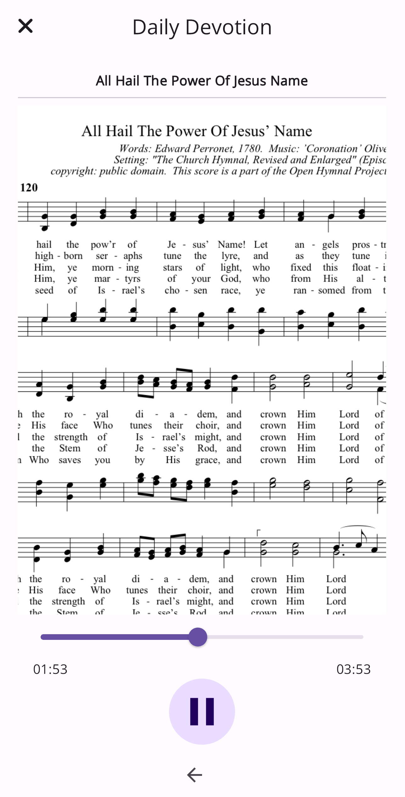
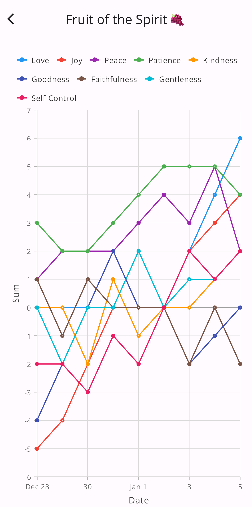
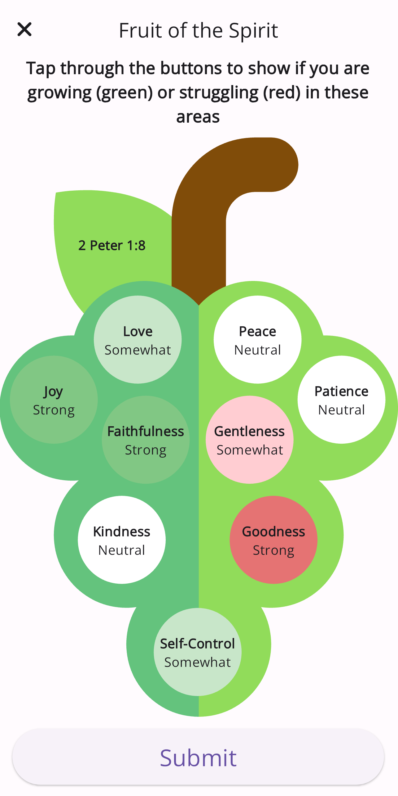

  <strong style="color: red; font-size: 1.2em;">⚠️ Important Notice: The app will be removed from the App Store on August 9, 2024. ⚠️</strong>

# Daily Discipleship

  

**Daily Discipleship** is a faith-based accountability app that tracks your daily personal devotions and spiritual growth.

## Features

- 📅 **Daily Devotion Tracking**: Users can create personalized profiles to track their daily devotions. The app provides guided scripture readings, prayer sessions, and hymn singing, with integrated music scores and audio accompaniment.
- 🌱 **Fruits of the Spirit Check-In**: This feature enables users to perform daily check-ins to reflect on their spiritual growth. It focuses on tracking progress in the fruits of the Spirit, helping users to deepen their understanding and application of these virtues.
- 📊 **Sanctification Progress Graph**: The app includes a visual graph that tracks users' spiritual journey over time. It highlights tangible growth in faith, providing a clear path towards spiritual maturity.
- 🔔 **Reminders & Notifications**: Users can set up reminders for their devotion times. The app sends in-app notifications to ensure users stay on track with their spiritual practices.

## Screenshots

  
   
  Hymn Player

  
   
  Spiritual Growth Metrics

  
   
  Spiritual Growth Metrics

## Tech Stack

- 🎯 [Flutter (Dart)](https://flutter.dev/)
- 🔥 [Firebase Authentication](https://firebase.google.com/docs/auth)
- 📄 [NoSQL Cloud Firestore](https://firebase.google.com/docs/firestore)
- 📀 [Firebase Cloud Storage](https://firebase.google.com/docs/storage)

## Support

For more information, support, and feedback, visit our [Daily Discipleship Website](https://www.daily-discipleship.com/).

## License

All rights reserved. Unauthorized copying, modification, distribution, or use of any part of this repository is strictly prohibited without express permission.

---

Thank you for checking out Daily Discipleship! We hope this app aids in your spiritual growth and journey.
